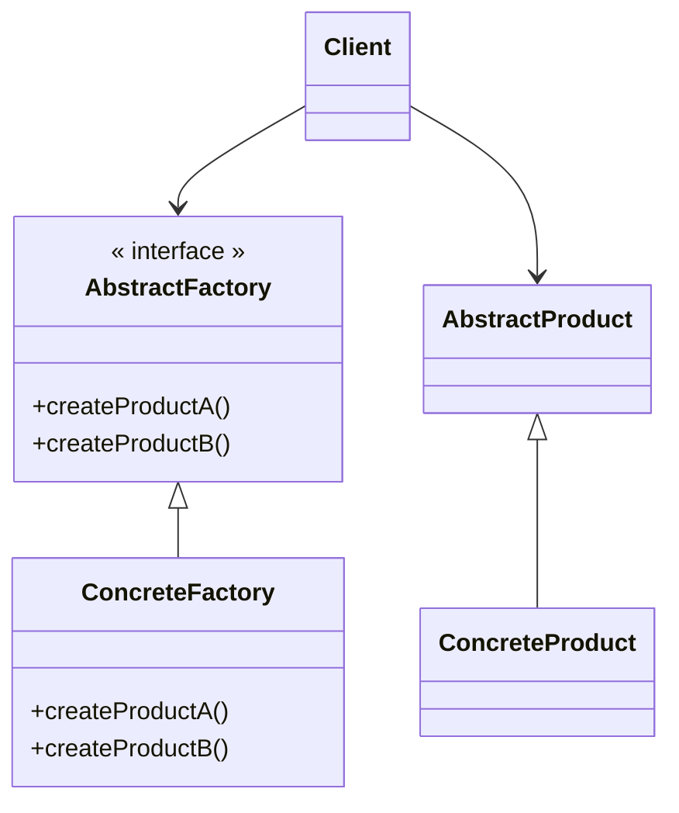

# Abstract Factory

## What it is

Provides an interface for creating
families of related or dependent
objects without specifying their
concrete class.

```mermaid
classDiagram
Client --> AbstractFactory
Client --> AbstractProduct

class AbstractFactory{
<< interface >>
+createProductA()
+createProductB()
}

class ConcreteFactory{
+createProductA()
+createProductB()
}
AbstractFactory<|--ConcreteFactory
AbstractProduct<|--ConcreteProduct
```
