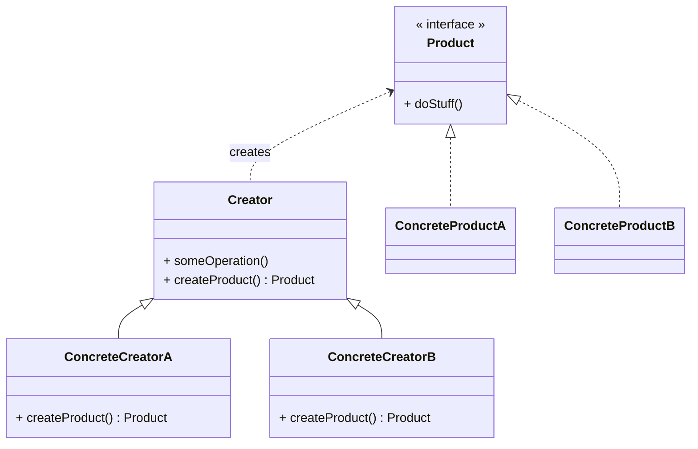

import Figure from "../../src/components/Figure";

# Factory Pattern

> **Factory Method** is a creational design pattern that provides an interface for creating objects in a superclass, but allows subclasses to alter the type of objects that will be created.
>
> [~ Refactoring Guru](https://refactoring.guru/design-patterns/factory-method)

<Figure caption={"Factory Pattern UML Class Diagram"}>



</Figure>

The Factory Method pattern allows subclasses to alter the type of objects created by a superclass, promoting flexibility and decoupling. It involves a creator class with a factory method that returns products, which must follow a common interface. Concrete creators override the factory method to return different product types, enabling the client code to treat all products interchangeably.

The Factory Method pattern creates objects through a factory method, allowing for loose coupling and easy extension. It enables the creation of new product types without modifying existing client code. The pattern can be used to reuse existing objects, saving system resources.

Prototype avoids inheritance drawbacks but requires complex initialization, while Factory Method, a Template Method specialization, eliminates initialization.


## Slides

<Figure caption={"Factory Pattern"} subcaption={
    <a href={"/slides-html/Factory-Pattern/#0"} target={"_blank"} rel="noopener noreferrer">full screen click here</a>
}>
    <iframe height={"500"} width={"100%"} src="/slides-html/Factory-Pattern/#0" title="W3Schools Free Online Web Tutorials"></iframe>
</Figure>

---

## Step by Step Implementation

In this tutorial, we’ll use the Factory Method pattern to create different types of buttons based on themes (e.g., round and square buttons). Each button follows the same interface to ensure they share a common structure, but each type has its own unique style.

Let’s begin by creating a `Button` interface with methods that all button types should implement. This will serve as our base interface.


<table><thead>
<tr>
    <td><div className={""}>

            <iframe height={"651px"} width={"294px"} src="/slides-html/Factory-Pattern-Implementation/#0" title="W3Schools Free Online Web Tutorials"></iframe>
    </div></td>
    <td>


```jsx live
    function ButtonDemo() {
    // Button interface with a render method
        class Button {
            render() {
                throw new Error("Method 'render()' must be implemented.");
            }
        }
    // Testing the interface
    const button = new Button();
    return <div>{button.render()}</div>; // This should throw an error since render isn't implemented.
}
```

    </td>
</tr></thead>
</table>


