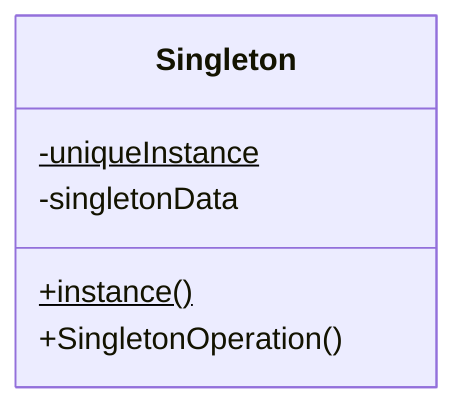

# Singleton Pattern in JavaScript

In this tutorial, we will explore the **Singleton Pattern** and how to implement it in JavaScript. The Singleton Pattern is a design pattern that ensures a class has only one instance and provides a global point of access to it.

Let's break down the steps and write the code together.

## Why Singleton?

The Singleton pattern is useful when exactly one instance of a class is needed to coordinate actions across the system. Think of it as a way to make sure that only one "manager" or "controller" is available throughout your code.

Some real-world examples might include:
- Database connections
- Logger utilities
- Configuration settings

## Let's Write a Singleton!



The following code block is interactive! Follow the steps to create your own Singleton class in JavaScript.

```jsx live
<button onClick={function(){
// Step 1: Define a Singleton class structure
class Singleton {

}

// Step 2: Test the Singleton instance
const instance1 = new Singleton();
const instance2 = new Singleton();
    alert(instance1.getData());
    alert(instance2.getData());

}}>
Show Result
</button>
```

<details>
    <summary>Solution</summary>

```jsx live
<button onClick={function(){
// Step 1: Define a Singleton class structure
    class Singleton {
        constructor() {
            // Check if an instance already exists
            if (Singleton.instance) {
                return Singleton.instance;
            }

            // Otherwise, initialize a new instance
            this.data = "I am the only instance!";
            Singleton.instance = this;

            return this;
        }

        getData() {
            return this.data;
        }
    }

// Step 2: Test the Singleton instance
    const instance1 = new Singleton();
    const instance2 = new Singleton();
    alert(instance1.getData());
    alert(instance2.getData());

}}>
    Show Result
</button>
```


</details>
