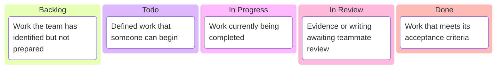

# Plan the Team Work

By the end of week one, your group of three should have a shared requirements draft, a reproducible guest cart bug report, a state map, and a reviewed as-is sequence diagram. Use those findings to plan the remaining experiments and report work.

## 1. Create a GitHub Project

One team member creates a new **Board** in [GitHub Projects](https://docs.github.com/en/issues/planning-and-tracking-with-projects/learning-about-projects/about-projects) and gives all three members access.

Use these columns:



Add the project link to the repository README or another location the whole team can find.

## 2. Create issues from your analysis

Create GitHub issues for unanswered requirement questions, the remaining architecture experiments, testing analysis, diagram revisions, and report sections. Link related work to the guest cart bug issue. Each issue should contain:

- A short, action-oriented title.
- The observation or question being investigated.
- A checklist of completion criteria.
- The evidence that must be captured.
- Links to related issues or code when relevant.

Keep each issue small enough for one student to own and another student to review.

```md title="Example issue"
## Goal
Compare guest cart behavior in single and scaled modes.

## Done when
- [ ] Run the session demonstration in both modes
- [ ] Record status, instance marker, and cookie name
- [ ] Add the evidence to the report draft
- [ ] Ask a teammate to review the interpretation
```

## 3. Assign work to one another

Each student creates at least one issue and assigns it to a different teammate. Distribute the issues so all three students own implementation or investigation work and review someone else's work.

Do not divide the lab into isolated sections that only one person understands. Use issue comments, linked evidence, and reviews to share findings across the team.

## 4. Work from the board

1. Move prepared issues from **Backlog** to **Todo**.
2. Move an issue to **In Progress** when work begins.
3. Limit each student to one in-progress issue at a time.
4. Move completed work to **In Review** and request a teammate's feedback.
5. Move the issue to **Done** only after its checklist is complete.

At each team meeting, review what moved, what is blocked, and what should happen next. Update the board as the plan changes.
:::tip[Checkpoint]

Before continuing, confirm that:

- The project contains the remaining lab work.
- The requirements, bug report, and as-is sequence diagram are linked from the project.
- Every issue has clear completion criteria.
- All three students have assigned work.
- Every issue in progress has one owner.
:::
Week 2 instructions will be released separately.
