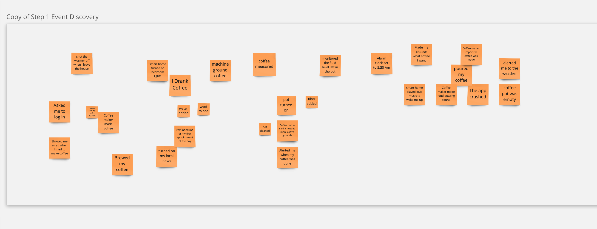
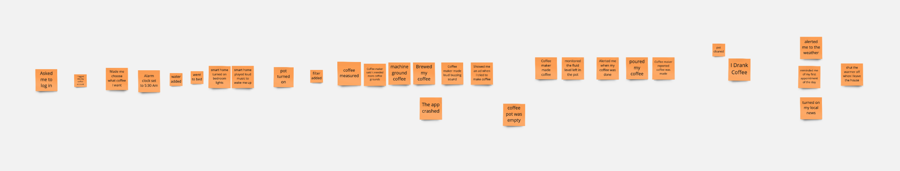

import Event from "../components/Event"; import Figure from "../components/Figure";

# Event Storming online workshop

:::important date, time, and location

<Event/>

<b>Online via Zoom!</b> 
<a href={"https://temple.zoom.us/j/98090966515"}>https://temple.zoom.us/j/98090966515</a>

Meeting ID: 980 9096 6515 

Ian Tyler Applebaum is inviting you to a scheduled Zoom meeting.

Topic: Projects in Computer Science Lab Event Storming 
Time: Jan 26, 2023 03:30 PM Eastern Time (US and Canada) 

One tap mobile 
+19292056099,,98090966515# US (New York) 
+13017158592,,98090966515# US (Washington DC) 

Dial by your location 
+1 929 205 6099 US (New York) 
+1 301 715 8592 US (Washington DC) 
+1 305 224 1968 US 
+1 309 205 3325 US 
+1 312 626 6799 US (Chicago) 
+1 646 931 3860 US 
+1 669 900 6833 US (San Jose) 
+1 689 278 1000 US 
+1 719 359 4580 US 
+1 253 205 0468 US 
+1 253 215 8782 US (Tacoma) 
+1 346 248 7799 US (Houston) 
+1 360 209 5623 US 
+1 386 347 5053 US 
+1 507 473 4847 US 
+1 564 217 2000 US 
+1 669 444 9171 US 
Meeting ID: 980 9096 6515 
Find your local number: https://temple.zoom.us/u/aezKhTFQu

:::

[Event storming](https://www.eventstorming.com) is a workshop-based method to quickly find out what is happening in the domain of a software program (or entire business initiative). There are 5 steps to the process, but we only realistically have time for 2 for this activity.

<Figure caption={"Event Storming Presentaion"} subcaption={
    <a href={"/event-storming-keynote"} target={"_blank"} rel="noopener noreferrer">full screen click here</a>
}>
    <iframe height={"500"} width={"100%"} src="/event-storming-keynote" title="W3Schools Free Online Web Tutorials"></iframe>
</Figure>

## Project Teams

This semester, my section has four projects. Two Mobile Applications, One chat integration, and a Progressive Web Applictaion. Each project team is comprised of 5-6 students. see the following table for project descriptions.

| Project Name            | Rough Description                                                                                                                                                                                                                                                                                                 |
|-------------------------|-------------------------------------------------------------------------------------------------------------------------------------------------------------------------------------------------------------------------------------------------------------------------------------------------------------------|
| Discord Class           | Discord is a popular chat application that many college students use. This project proposes to make a learning management system for a college that could be run entirely within the discord chat application using a series of text commands for turning in assignments, quizzes, and other relevant coursework. |
| Group Meet              | Group meet is an application to help remove friction for students starting a group project. It allows students with cell phones to simply scan a code and share their contact information and schedules.                                                                                                          |
| Study Buddy Virtual Pet | Study buddy virtual pet tries to "gameify" studying by adding a virtual pet that you take care of by studying. Much like the popular Tamagotchi toy from the late 90s early 2000s.                                                                                                                                |
| Tool Shed               | Tool shed is an application that is trying to help users plan and rent community owned tools for their various home improvement projects.                                                                                                                                                                         |

## Workshop

### Join Miro 

We will be running this workshop in class using [Miro.](https://miro.com/welcome/azd0UzBtUmxhTW9SY2FMcDUwUGRBUnl4SWJTWWZsdzBSdW41UzdEdkFFS0FzTFFXcW1TMDVhM0hkZFo1eWN0cnwzMDc0NDU3MzY1MzIxMjgyMjQ4?share_link_id=317746713706) [Click here to open the class event storming board!](https://miro.com/app/board/uXjVPtOqBHI=/?share_link_id=767170166557)

:::info Join our Miro Classroom team to edit the board

https://miro.com/welcomeonboard/NHFRUm1hWnEzTW02TWZrZks4N2ozdVBNN3psdnZCWTRzQWN1c011RnFBMzdhU3E4ZGh5T2FuaWpOcXZLWFZ3b3wzMDc0NDU3MzY1MzIxMjgyMjQ4fDI=?share_link_id=967360363669

:::

<iframe width="768" height="432" src="https://miro.com/app/live-embed/uXjVPtOqBHI=/?moveToViewport=-19794,-9302,6397,3556&embedId=631810532039" frameborder="0" scrolling="no" allow="fullscreen; clipboard-read; clipboard-write" allowfullscreen/>

### 1. Discover Events

Events are things that happen in your application. They are written in the past tense. Let's say we're hypothetically designing a smart coffee maker. One event that would happen in the coffee brewing process is:  "_My coffee maker made a loud buzzing sound to let me know the the coffee \`is ready\`_." or "_I drank the coffee made_". You will discover these events silently as a group for 10 minutes adding them to the top row of the Miro board as **orange sticky notes** (order does not matter in this step just write as many events as you can think of). 

### 2. Enforce Timeline

Take the events discovered in the previous step and start physically ordering them in the second row as a timeline. Discuss as a group if the events fit properly, if there are missing events add them. If an event doesn't make sense or is out of scope, add it to the bottom row known as the parking lot. After reading the time line multiple times, read the timeline backwards. Typically if you're missing an event in the timeline it's a lot more obvious when read backwards. 

**YOU SHOULD HAVE MORE EVENTS THAN THE ABOVE EXAMPLE.**

Why? As we are still finalizing the Requirements Document, this exercise helps us gather requirements WITH the customer. 

For this class we will focus mainly on discovering the Events that happen in your project, and ordering them into a cohesive timeline.

